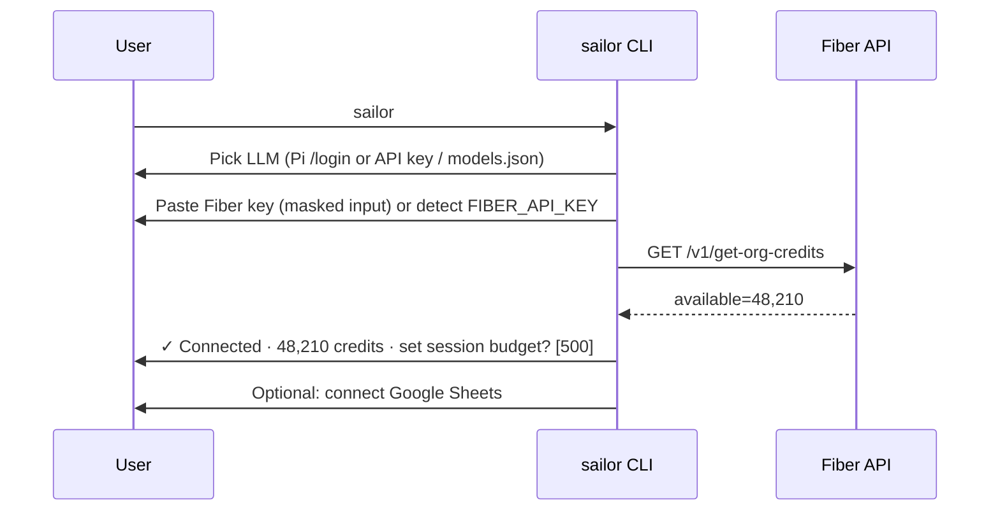

# 03 — Architecture

> **Implementation note (v0.1):** the build follows this design with four deliberate deviations. Details are in [08](08_Implementation_Status.md).
> 1. Storage uses Node's built-in **`node:sqlite`** instead of `better-sqlite3` (no native build; needs Node ≥ 22.13).
> 2. At runtime, Fiber is called through Sailor's own fetch-based `FiberClient` with an operation registry, not through `@fiberai/sdk`. The SDK remains the vibe-coding target.
> 3. The MCP bridge is a small built-in Streamable-HTTP client, not `@modelcontextprotocol/sdk`.
> 4. Google OAuth, Sheets and Drive, plus S3/R2 presigning, use plain REST/`fetch`. `googleapis` is not a dependency, and the only Google scope requested is `drive.file`.

## 1. Build strategy: extend Pi, don't hard-fork it

| Option | Pros | Cons | Verdict |
|---|---|---|---|
| **A. Pi package** (`@sailor/pi-fiber`): extensions + skills + prompts + theme | Upstream Pi updates for free; users can `pi install` it; smallest surface | Branding limited to Pi's shell | **Core deliverable** |
| **B. Thin launcher** (`sailor` CLI) that embeds Pi via SDK `createAgentSession()` or spawns `pi` with our package + `AGENTS.md` + defaults | Branded first-run onboarding, own config dir, `npx sailor` works | Small extra code | **Ship on top of A** |
| C. Hard fork of pi-mono | Total control | Merge pain, you own the whole agent loop | Avoid |

**Decision:** A + B. All functionality lives in the Pi package. The `sailor` binary is a convenience wrapper that sets defaults (theme, system prompt, skills, disabled coding tools if desired) and runs onboarding.

## 2. High-level diagram

```mermaid
flowchart LR
  U[User in terminal] --> TUI[Pi TUI\n(editor, transcript, footer)]
  TUI --> AG[Pi agent loop]
  AG <--> LLM[(User's LLM\nAnthropic/OpenAI/Gemini/\nOpenRouter/Ollama...)]
  AG --> EXT[Sailor extension]
  subgraph EXT[Sailor Pi package]
    T1[Typed Fiber tools\n(@fiberai/sdk)]
    T2[MCP bridge\nFiber MCP v2 + Core]
    CG[Cost guard\n(tool_call hook)]
    CM[Credit meter\n(footer status)]
    JM[Job manager\nMosaic / batch polling]
    LS[List store\nSQLite]
    UI[TUI panes & cards\n(pi-tui components)]
    EX[Exporters\nSheets / CSV / XLSX]
    SK[Skills & prompts\nsales / GTM / recruiting / fiber-sdk]
  end
  T1 --> FAPI[(api.fiber.ai)]
  T2 --> FMCP[(mcp.fiber.ai)]
  CM --> FAPI
  JM --> FAPI
  EX --> GS[(Google Sheets API v4)]
  JM --> HOST[(Temp public file host\nfor Mosaic input)]
```

## 3. Repository layout

```
sailor/
├─ packages/
│  ├─ pi-fiber/                    # the Pi package (npm: @sailor/pi-fiber)
│  │  ├─ package.json              # "pi": { extensions, skills, prompts, themes }
│  │  ├─ extensions/
│  │  │  └─ sailor/
│  │  │     ├─ index.ts            # default export (pi: ExtensionAPI) => wire everything
│  │  │     ├─ config.ts           # key loading, settings, budgets
│  │  │     ├─ fiber/
│  │  │     │  ├─ client.ts        # @fiberai/sdk wrapper: key injection, retry, 429, 402
│  │  │     │  ├─ cost.ts          # estimates from creditsPerOperation + static table
│  │  │     │  ├─ ops.ts           # registry: opId → {paid, estimator, idempotent, rateLimit}
│  │  │     │  └─ trim.ts          # shrink big payloads for the LLM, keep full copy in store
│  │  │     ├─ tools/              # one file per typed tool (see 04_Feature_Specs)
│  │  │     ├─ mcp/bridge.ts       # Streamable HTTP MCP client → dynamic Pi tools
│  │  │     ├─ guard/costGuard.ts  # pi.on("tool_call") → estimate → confirm/block
│  │  │     ├─ meter/credits.ts    # footer credit meter + session spend ledger
│  │  │     ├─ jobs/manager.ts     # persistent async jobs (Mosaic, batch reveal, audiences)
│  │  │     ├─ store/db.ts         # SQLite (better-sqlite3): lists, entities, cache, jobs, ledger
│  │  │     ├─ io/                 # csv/xlsx parse+sanitize, file hosting adapters
│  │  │     ├─ export/sheets.ts    # Google OAuth (loopback) + Sheets API v4
│  │  │     ├─ ui/                 # ListPane, ProspectCard, CompanyCard, JobsWidget, renderers
│  │  │     └─ commands/           # /fiber, /lists, /repair, /enrich, /export, /budget, /jobs
│  │  ├─ skills/
│  │  │  ├─ fiber-sdk/             # vendored from fiber-ai/typescript-sdk/skills/fiber-sdk
│  │  │  ├─ sailor-prospecting/SKILL.md
│  │  │  ├─ sailor-list-repair/SKILL.md
│  │  │  ├─ sailor-cold-call/SKILL.md
│  │  │  ├─ sailor-sales-strategy/SKILL.md
│  │  │  ├─ sailor-recruiting/SKILL.md
│  │  │  └─ sailor-gtm-engineering/SKILL.md
│  │  ├─ prompts/                  # /icp, /callscript, /sequence, /account-plan, /sourcing
│  │  └─ themes/sailor.json
│  └─ sailor-cli/                  # `sailor` launcher + onboarding (embeds Pi SDK)
├─ examples/                       # messy CSVs, sample sessions, vibe-coded scripts
├─ evals/                          # scripted scenarios run in print/json mode
└─ docs/
```

## 4. Core components

### 4.1 Fiber client wrapper (`fiber/client.ts`)
- Resolves the key from `FIBER_API_KEY` → `FIBERAI_API_KEY` → OS keychain (`keytar`) → `~/.sailor/credentials.json` (mode 0600).
- **Injects `apiKey` at execution time.** The LLM never sees or supplies the key, and tool schemas never include `apiKey`.
- Sets headers `x-api-key` and `User-Agent: sailor/<ver>` through `client.setConfig()` or an interceptor.
- Retries: 429 → honor `Retry-After` or per-route limit from `getRateLimits`, with exponential backoff and jitter. 5xx → retry **only if the op is idempotent/free**. Paid ops time out with "unknown outcome" and never auto-retry (see 06).
- 402 → raise `OutOfCreditsError(purchaseUrl)`. The UI shows a banner and the job is paused, not failed.
- Parses `chargeInfo` from every response and emits `fiber:charge` to the meter/ledger.
- Client-side token-bucket rate limiter per route family.

### 4.2 Operation registry (`fiber/ops.ts`)
One table drives cost guard, retries, and UI:

```ts
type OpMeta = {
  opId: string;                  // e.g. "KitchenSinkProfile" (case-sensitive)
  paid: boolean;
  idempotent: boolean;           // safe to retry?
  estimate: (args) => { credits: number; basis: string };  // e.g. "20 × 2 (work email)"
  rpm: number;
  async?: { pollOp: string; intervalMs: number };          // ≥ 30_000 by default
};
```
Estimates come from `getOrgCredits.creditsPerOperation` (centiCredits ÷ 100), cached per session, with a static fallback table from the billing docs.

### 4.3 Tool layer: three tiers

| Tier | What | Why |
|---|---|---|
| **1. Typed GTM tools** (~20) | `fiber_search_people`, `fiber_search_companies`, `fiber_nl_search`, `fiber_resolve_person/company` (Kitchen Sink), `fiber_reveal_contacts`, `fiber_repair_list`, `fiber_validate_emails`, `fiber_audience_*`, `fiber_credits`, `list_*`, `export_sheets`… | Tight schemas the LLM uses well, rich renderers, exact cost estimates, output trimming |
| **2. Fiber MCP Core** (5 meta-tools) | `search_endpoints`, `get_endpoint_details_full`, `call_operation`, `list_tag_packs`, `list_all_endpoints` | Full 200+ op coverage in a tiny context footprint. `call_operation` still passes the cost guard |
| **3. Code mode** | Pi's built-in `bash`/`write` + `fiber-sdk` skill | GTM engineers vibe-code reusable TS scripts against `@fiberai/sdk` |

A **"lite tools" profile** for weaker/local models exposes only Tier 1 (≈8 tools) and disables Tier 2/3.

### 4.4 Cost guard (`guard/costGuard.ts`)
`pi.on("tool_call")` runs before every tool execution:
1. Maps the tool (or `call_operation` + `operationId`) to `OpMeta`. Unknown ops are treated as paid with an unknown cost, which requires confirmation.
2. Computes the estimate and compares it against: `available` credits, the **per-call auto-approve threshold** (default 25 credits), the **session budget** (default 500), and the **daily budget**.
3. Under the threshold: allow, and show the estimate in the footer. Over it: `ctx.ui.confirm("Spend ~40 credits?", "20 people × 2 (work email). Balance 48,210 → ~48,170")`. Over budget or over balance: **block** with a reason the LLM can relay.
4. Headless (`!ctx.hasUI`, `-p`, RPC): obey `--fiber-max-spend <n>` or `SAILOR_AUTO_APPROVE`. Otherwise block paid calls.

### 4.5 Credit meter (`meter/credits.ts`)
- On `session_start`: `getOrgCredits` → `ctx.ui.setStatus("fiber", "Fiber 48,210 cr · session −0")`.
- After each `fiber:charge`: optimistic decrement from `chargeInfo`, then a debounced true refresh (free endpoint, ≤ 1 per 10 s).
- Background refresh every 60 s while the session is active (catches spend from other tools/users on the same org).
- Color states: normal / low (<10% or <500, matching Fiber's alert thresholds) / empty (402 seen).
- `/credits` shows the breakdown: org max/used/available, reset date, this session's ledger by operation, and a link to top up.

### 4.6 List store (`store/db.ts`, SQLite in `~/.sailor/sailor.db`, or project-local `.sailor/` if present)

```sql
lists(id, name, kind /*people|companies*/, source, created_at, updated_at)
entities(id, kind, fiber_id, linkedin_url, domain, name, data_json, fetched_at)
list_items(list_id, entity_id, position, status /*new|enriched|contacted|excluded*/, notes, UNIQUE(list_id, entity_id))
contacts(entity_id, type /*work_email|personal_email|phone*/, value, validity, source_op, fetched_at)
jobs(id, op, remote_id /*runId/taskId*/, status, params_json, result_json, created_at, next_poll_at)
cache(key /*opId+normalized args hash*/, response_json, charge_json, fetched_at, ttl_s)
ledger(id, session_id, op, estimated, charged, charge_json, at)
exports(id, list_id, target /*sheets|csv|xlsx*/, url, at)
```
- Tools return **handles** such as `list:q4-revops (52 people)` plus a small preview, not 52 × 44 fields. The LLM calls `list_get(listId, fields, limit)` when it needs details.
- The same resolution cache avoids paying twice for the same person within the TTL (default 30 days for firmographics, 90 days for contact data, both configurable).

### 4.7 Job manager (`jobs/manager.ts`)
- Persists async jobs (Mosaic runs, batch contact reveal, batch live enrich, audience build/enrich, exhaustive reveal).
- Polls at ≥ 30 s (Fiber guidance) using one timer for all jobs, and survives restarts: on `session_start`, pending jobs are resumed.
- Shows a `JobsWidget` via `ctx.ui.setWidget("sailor-jobs", [...])`, e.g. `Mosaic hubspot_export.csv ▓▓▓▓░░ 612/1204`.
- On completion: downloads the output **immediately** (Mosaic URLs are temporary), imports it into a list, notifies, and optionally `pi.sendMessage()`s a summary into the conversation so the agent can continue.

### 4.8 TUI layer (`ui/`)
- `ListPane`: a virtualized table (ScrollView) with column presets, sorting, filters, multi-select, and key actions (`e` enrich, `r` repair, `x` export, `v` validate, `Enter` open card, `d` exclude, `/` filter).
- `ProspectCard` / `CompanyCard`: overlay cards (name, title, tenure, location + local time, contacts with validity badges, funding, headcount trend sparkline, tech stack, recent posts).
- Tool renderers (`renderCall` / `renderResult`): compact tables inline in the transcript instead of JSON dumps, with the cost line `charged 18.0 cr`.
- Footer status: credits, session spend, budget, active jobs count.

### 4.9 MCP bridge (`mcp/bridge.ts`)
- Uses `@modelcontextprotocol/sdk` `Client` + `StreamableHTTPClientTransport` to `https://mcp.fiber.ai/mcp` (Core) and optionally `/mcp/v2`, with header `x-api-key`.
- On `session_start`: `listTools()` → `pi.registerTool` for each (name-prefixed `fibermcp_`), with a JSON Schema → TypeBox passthrough.
- Every call goes through the same cost guard (keyed by `operationId` for `call_operation`).
- Alternative for the hackathon: depend on `pi-mcp-adapter` and ship a config. The trade-off is less control over the cost guard.

### 4.10 Exporters (`export/`)
- **Google Sheets:** OAuth 2.0 installed-app flow with a loopback redirect (or device flow). The refresh token goes in the keychain. Scope `https://www.googleapis.com/auth/drive.file` (only files Sailor creates) plus `spreadsheets`. Create → `values.batchUpdate` in 1k-row chunks with `valueInputOption=RAW` (prevents formula injection) → format header, freeze row 1, auto-resize → return the URL. Supports append/upsert into an existing sheet by key column.
- CSV / XLSX local export with formula-injection escaping.
- Sequencer presets: column mappings for common tools (Outreach, Salesloft, Apollo, Instantly, Smartlead, HubSpot import).

### 4.11 Skills and system prompt
- `AGENTS.md` / appended system prompt: Sailor's role, the cost etiquette (quote costs, prefer free count endpoints first, use handles), data-grounding rules for scripts, and compliance guardrails.
- Skills are loaded on demand, which keeps the base context small.

## 5. Key flows

### 5.1 First run / onboarding


### 5.2 Prospecting (chat → list → enrich)
1. The user describes the ICP → the agent calls `fiber_nl_search` (`nlpSearchParse`) to get structured params. It shows them and asks for tweaks.
2. `peopleSearchCount` (free) → "~1,240 matches, first page of 25 costs ~25 credits."
3. `fiber_search_people` → results stored as a list; the ListPane opens.
4. "Enrich emails for top 20" → cost guard confirms 40 credits → `syncQuickContactReveal` per row (or batch), then `emailBounceDetection` optionally.
5. The ledger and meter update.

### 5.3 Repair a messy list
```mermaid
flowchart TD
  A[/repair file.csv or Sheet URL/] --> B[Parse locally: encoding, delimiter, header row, row count]
  B --> C{Rows ≤ 50 and simple?}
  C -- yes --> D[Kitchen Sink bulk\n(50/call, sync)]
  C -- no --> E[Estimate Mosaic cost\n(rows × options, first 1k free)]
  E --> F[Confirm]
  F --> G[Upload to temp public URL\n(or use public Sheet URL)]
  G --> H[POST /v1/mosaic/start]
  H --> I[Job manager polls /mosaic/poll every 30s]
  I --> J{status}
  J -- done --> K[Download outputCsvUrl + reportUrl now\nImport into list, show stats]
  J -- failed --> L[Show error, keep input, offer KS-bulk fallback]
  K --> M[Revoke temp URL · offer export]
```

### 5.4 Cold-call script generation
1. `list_get` fetches the grounding fields (role, tenure, company funding, headcount trend, recent posts, local timezone).
2. The `sailor-cold-call` skill template applies: opener → reason for calling (a data-backed trigger) → value prop → discovery questions → objection handling → CTA.
3. Every factual claim cites its field (e.g. `[funding.latest: Series B, $40M, 2026-05]`). Ungrounded claims are forbidden. Best call window is computed from the prospect's timezone.
4. Output goes to the list (`notes`), and can be exported to Sheets/Markdown.

## 6. Configuration

`~/.sailor/config.json` (project `.sailor/config.json` overrides):
```json
{
  "fiber": { "mcp": ["core"], "baseUrl": "https://api.fiber.ai" },
  "budget": { "autoApproveUnder": 25, "session": 500, "daily": 2000 },
  "cache": { "profileTtlDays": 30, "contactTtlDays": 90 },
  "toolsProfile": "full",            // "lite" for small/local models
  "hosting": { "provider": "gdrive" }, // gdrive | s3 | r2 | manual
  "export": { "sheets": { "defaultFolderId": null } },
  "compliance": { "region": "US", "requireSuppressionCheck": true }
}
```

## 7. Tech choices

| Need | Choice |
|---|---|
| Language/runtime | TypeScript, Node ≥ 20 (Pi's runtime; SDK needs ≥ 18) |
| Fiber | `@fiberai/sdk` (+ `@fiberai/sdk/zod` for validation) |
| MCP | `@modelcontextprotocol/sdk` (Streamable HTTP client) |
| Storage | `better-sqlite3` |
| CSV/XLSX | `papaparse` (or `csv-parse`), `exceljs` / `xlsx`, `chardet` + `iconv-lite` for encodings |
| Google | `googleapis` (Sheets v4, Drive v3), `google-auth-library` |
| Secrets | `keytar` (fallback to a 0600 file) |
| Tests | `vitest`, `msw` for HTTP mocks, Pi print/json mode for e2e evals |
